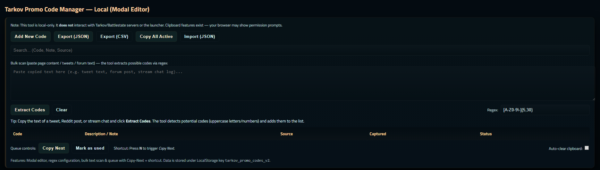
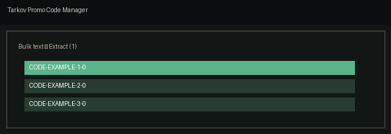

Tarkov Promo Code Manager (Local)
=================================

A single-file, browser-only utility to collect, tag, extract and manage Escape From Tarkov promo codes locally in your browser.

Files
- `index.html` — the complete app (HTML/CSS/JS). Open this file in your browser to run the app.

Screenshot
---------

Below is a screenshot of the app. The real screenshot is included in `assets/`.



Quick start
1. Open `index.html` in your browser (double-click or use `File → Open`).
2. Add codes with "Add New Code" or paste bulk text into the Bulk area and click "Extract Codes".
3. Use the queue controls (Copy Next / Mark as used) to work through codes. The `N` key triggers Copy Next.
4. Export JSON/CSV for backup, or paste JSON into the import area to merge.

What it does
- Stores data locally in LocalStorage (no network calls).
- Extracts candidate codes from pasted text using a configurable regex.
- Provides a modal editor (Code required) and status tags (unknown, active, expired, verified, used).
- Queue system with "Copy Next" and clipboard fallback if writing to clipboard is blocked.
- Import/Export (JSON and CSV) with merge-by-code behavior.

Data model
Each entry is a plain object with the following fields:
- `code` (string) — required
- `note` (string)
- `source` (string)
- `seen` (string) — date in YYYY-MM-DD
- `status` (string) — one of `unknown`, `active`, `expired`, `verified`, `used`
- `queued` (boolean)

LocalStorage keys
- `tarkov_promo_codes_v2` — stores the array of entries in JSON
- `tarkov_promo_codes_regex` — stores the configured extraction regex

Customization & development
- To change the extraction limit, edit `MAX` in `extractFromBulk()`.
- To change the storage key, edit `KEY` at the top of the script.
- To replace the `confirm()` delete dialog with a modal, update the delete handler in the table click listener.

Design notes
- The app is styled in an Escape From Tarkov inspired dark, military palette. The font (Titillium Web) is loaded from Google Fonts.
- The app intentionally avoids any automated interaction with the game launcher for safety.

Next steps (ideas)
- Add an EFT logo or subtle texture to the header.
- Replace `confirm()` with a custom confirm modal.
- Add accessibility improvements (focus trap, aria-hidden toggling for modals).
- Add unit tests for extraction and merge logic (refactor helpers into a testable module).

License
- This is a small, local utility. Add your own license file if you intend to publish or distribute it.

Demo GIF
--------
To make a short demo GIF showing typical flows (bulk extract → queue → copy next):

1. Open `index.html` in a browser window sized to your target resolution (e.g., 1280×360). Clean the app state (clear localStorage) for a fresh demo.
2. Use a screen recorder that can export to GIF. Recommended tools:
	- Windows: ShareX (free) — allows region capture and GIF export.
	- macOS: QuickTime to record + Gifbrewery or an online converter, or use Kap (open source) for GIF export.
	- Linux: Peek (simple GIF recorder) or record with ffmpeg and convert to GIF.
3. Record a short sequence (5–12 seconds):
	- Click "Add New Code" and add a sample code (or paste a small block into Bulk and Extract Codes).
	- Click "Copy Next" so viewers see the clipboard behavior (if clipboard blocked, show manual copy popup).
	- Mark as used to show the status change.
4. Save the GIF, optimize size (reduce colors or frame rate if large), and add it to the README or project assets.

Embedding the final GIF
---------------------
Place `demo.gif` in `assets/` and reference it in this README with:

```

```

That's it — the README now shows a screenshot placeholder and step-by-step instructions to create a demo GIF for the project.
